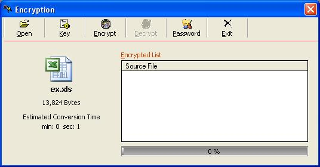



## encryption for all data format

### Description

Hi guyz this is my thesis last 2006-2007 before i graduated in my course...

This code if for encryption...unlike other encryption codes, it does not change

the file extention of the encrypted file

Please don't forget to vote.
 
### More Info
 

             |
---                |---
**Submitted On**   |2008-10-28 14:39:52
**By**             |[Joey A\. Caballero](https://github.com/Planet-Source-Code/PSCIndex/blob/master/ByAuthor/joey-a-caballero.md)
**Level**          |Intermediate
**User Rating**    |5.0 (35 globes from 7 users)
**Compatibility**  |VB 4\.0 \(16\-bit\), VB 4\.0 \(32\-bit\), VB 5\.0, VB 6\.0
**Category**       |[Encryption](https://github.com/Planet-Source-Code/PSCIndex/blob/master/ByCategory/encryption__1-48.md)
**World**          |[Visual Basic](https://github.com/Planet-Source-Code/PSCIndex/blob/master/ByWorld/visual-basic.md)
**Archive File**   |[encryption21355511272008\.zip](https://github.com/Planet-Source-Code/joey-a-caballero-encryption-for-all-data-format__1-71454/archive/master.zip)

